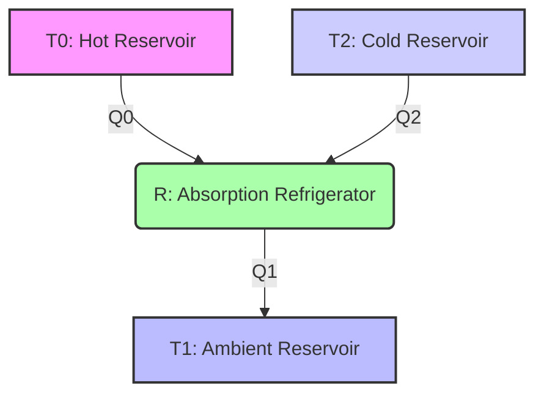

```mermaid
graph TD
T0[T0: Hot Reservoir] -->|Q0| R
T2[T2: Cold Reservoir] -->|Q2| R
R(R: Absorption Refrigerator) -->|Q1| T1[T1: Ambient Reservoir]

style T0 fill:#f9f,stroke:#333,stroke-width:2px
style T1 fill:#bbf,stroke:#333,stroke-width:2px
style T2 fill:#ccf,stroke:#333,stroke-width:2px
style R fill:#afa,stroke:#333,stroke-width:2px
```
